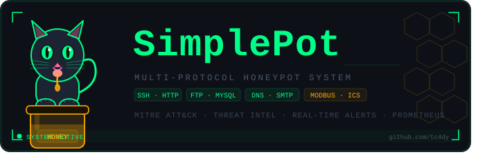

# 🍯 SimplePot – See How Attackers Think

> 🧠 *A single‑developer with AI, ~2500‑line educational honeypot – not production‑grade, but fully working and open to your improvements.*

**350‑char description:**  
🔍 Observe live SSH brute‑force, SQLi, DNS tunnelling & more.  
📡 12+ protocols (HTTP/SSH/FTP/MySQL/Redis/DNS/SNMP/Modbus/WebSocket).  
📊 SQLite + live dashboard + MITRE ATT&CK mapping.  
🛠️ Clone, run, learn, extend. **Not a commercial product – a learning toolkit.**  

🔗 **Clone:** `git clone https://github.com/tc4dy/SimplePot`  

---

## 📌 What is this?

**SimplePot** is a low‑interaction honeypot written from scratch in Python asyncio.  
It simulates common network services, logs every attacker action, and maps events to MITRE ATT&CK techniques.

**This is not a polished enterprise tool.**  
It was built by **one person** to understand attack patterns, test detection logic, and provide a **transparent, hackable** base for learning.  
The code is ~2500 lines, monolithic by design – so you can read, modify, and improve it without hunting through dozens of files.

---

## 🧠 Educational goals

- See **exactly what credentials** attackers try (SSH, FTP, MySQL, SMTP, HTTP forms).
- Watch **live commands** on a fake shell (`id`, `wget`, `cat /etc/passwd`).
- Learn how **threat scoring** works (payload patterns + behaviour).
- Understand **MITRE ATT&CK mapping** (25+ techniques directly from flags).
- Experiment with **active defence** (rate limiting, iptables banning).
- Build your own **fake responses** by editing Python dicts.

---

## 🚀 What works (and what doesn’t)

| ✅ Works (tested) | ❌ Not implemented (by design) |
|------------------|--------------------------------|
| SSH, HTTP, HTTPS, FTP, MySQL, SMTP, Redis, Modbus, DNS (TCP+UDP), SNMP, WebSocket | Malware capture / file storage |
| Credential logging + live dashboard | PostgreSQL / Elastic stack |
| MITRE ATT&CK technique mapping | IPv6 full support (basic only) |
| Slack / Telegram / webhook alerts | GeoIP / Tor detection (stubs) |
| IP banning via iptables | Docker / Kubernetes manifests |
| Prometheus metrics (`/metrics`) | High‑performance (SQLite is fine for learning) |
| GDPR‑compliant IP anonymisation | Multi‑tenant / cloud‑ready |

> The code is **working and stable** for moderate traffic (hundreds of events/minute).  
> For massive production workloads, use T‑Pot or Cowrie – but for **learning and experimenting**, this is perfect.

---

## 🔧 How it works (the logic, step by step)

1. **Service emulation** – each protocol runs in an `asyncio` server.
2. **Connection** – logs source IP, creates a session, checks rate‑limits / bans.
3. **Interaction** – depending on the protocol:
   - SSH: fake shell with hardcoded command responses (`SSH_COMMANDS` dict).
   - HTTP: fake admin panels, login forms, API endpoints, `.env` files.
   - FTP/MySQL/SMTP/Redis: minimal banner + credential capture.
   - DNS: logs queries, flags long subdomains as tunnelling.
   - Modbus: responds with error code, raises ICS alert.
4. **Payload analysis** – regex patterns against raw data → flags (SQLi, XSS, RCE, …).
5. **Threat score** – combines flags, event frequency, known bad IPs, protocol diversity.
6. **MITRE mapping** – converts flags + event type into ATT&CK technique IDs (T1110, T1190, …).
7. **Persistence** – events are batch‑written to SQLite (WAL mode) to avoid locking.
8. **Alerting** – if score ≥ threshold (70), sends to Slack/Telegram/webhook (cooldown per IP).
9. **Dashboard** – live stats, top attackers, MITRE tags, export JSON/STIX.

All fake banners, files, SSH command responses are plain Python data structures – you can change them without restarting (except config).

---

## 📥 Installation & first run

```bash
git clone https://github.com/tc4dy/SimplePot
cd SimplePot
pip install aiohttp asyncssh dnspython cryptography
sudo python3 simplepot.py   # sudo needed only for iptables banning

Ports used (change in CONFIG dict):
2222 (SSH), 8080 (HTTP), 8443 (HTTPS), 2121 (FTP), 3306 (MySQL), 2525 (SMTP), 6379 (Redis), 502 (Modbus), 5353 (DNS), 1610 (SNMP).
Dashboard: http://localhost:7777
Prometheus metrics: http://localhost:7777/metrics
🧪 Try it yourself
bash

# SSH brute‑force simulation
ssh -p 2222 root@localhost          # any password works for root

# HTTP credential stuffing
curl -X POST http://localhost:8080/wp-login.php -d "log=admin&pwd=12345"

# DNS tunnelling detection
dig @localhost -p 5353 a.very.long.subdomain.that.looks.suspicious.example.com

# Modbus ICS scan
nmap -p 502 --script modbus-discover localhost

Open the dashboard – every event appears with a threat score and MITRE tags.
📂 Project structure (single file – easy to explore)
text

simplepot.py           # all classes and logic (~2500 lines)
/tmp/honeypot_data/    # runtime data
  ├── honeypot.db      # SQLite database
  ├── keys/            # SSH host key
  └── certs/           # self‑signed TLS cert for HTTPS

Because everything is in one file, you can search, modify, and run without context‑switching – ideal for learning.
🔐 Environment variables for alerts
bash

export SLACK_WEBHOOK="https://hooks.slack.com/..."
export TELEGRAM_TOKEN="123456:ABC"
export TELEGRAM_CHAT_ID="-123456"
export WEBHOOK_URL="https://your-endpoint.com/alert"

🤝 Contributing & extending

This project is open to your improvements.
You can:

    Add new protocols (LDAP, RDP, VNC – stubs are already in CONFIG).

    Implement GeoIP with Maxmind DB.

    Replace SQLite with PostgreSQL.

    Write a Dockerfile.

    Fix the few rough edges (IPv6, session replay, etc.).

The code is written to be read – not to be the “perfect” architecture.
